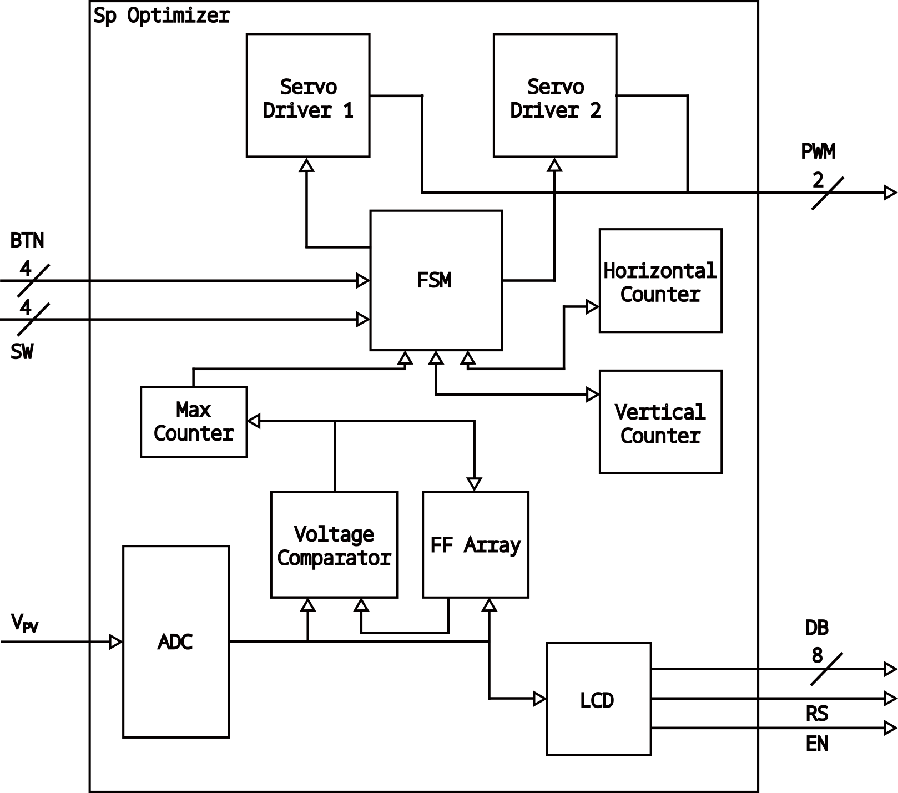

# FPGA Implementation Of Dual Axis Solar Panel Orientation Optimizer Using Verilog HDL

# Contents

* [**Abstract**](#abstract)
* [**Project Main Modules**](#project-main-modules)
* [**Simulations**](#simulations)
* [**Git instruction**](#git-instruction)

# Abstract
[**[Contents]**](#contents)

This project implements a dual-axis solar panel orientation optimizer using an Arty A7 FPGA programmed with Verilog HDL. The system aims to maximize the efficiency of photovoltaic systems by optimizing the solar irradiance incident on the panels. It utilizes embedded ADC for voltage monitoring and two servo motors to adjust the solar panel's elevation and azimuth angles. The device operates in both manual and calibration modes, ensuring precise solar panel positioning.

<div align="center">
   
   <p style="text-align:center">Solar Panel Optimizer in action</p>
</div>

# Project Main Modules
[**[Contents]**](#contents)

### Overview

<div align="center">
  &nbsp;&nbsp;&nbsp;&nbsp;&nbsp;&nbsp;&nbsp;&nbsp;&nbsp;&nbsp;&nbsp;
  <p style="text-align:center">System Schematic and Block Diagram</p>
</div>

The solar tracking system revolves around the "sp_optimizer" module, which interfaces with various components. It utilizes the ADC for voltage conversion, a voltage comparator to track peak voltages, and a servo driver for motor control. The "debouncer" module ensures reliable user interaction. An FSM manages the system's overall state, facilitating autonomous operation during calibration.

### FSM

<div align="center">
    
   <p style="text-align:center">FSM State Diagram</p>
</div>

The FSM module serves as the core control unit of the system, managing the device's operational states. It defines five states:
1. **Manual Mode**: The default state where the user manually controls the tracker via buttons. When the calibration switch is logically high, the FSM transitions to the first calibration state.
2. **Horizontal Sweep**: The tracker performs a horizontal scan looking for the maximum voltage value. It switches to the horizontal maximum state when the variable "CNT L" is logically low, indicating the horizontal plane has been completely scanned.
3. **Horizontal Max**: The tracker moves to the position of maximum horizontal irradiance and switches to vertical scanning when "CNT RU" becomes low, representing that an interval of time, equal to the time needed by the device to rotate over the full horizontal range, has passed permitting the solar panel to be set in the right position.
4. **Vertical Sweep**: The tracker performs a vertical scan looking for the maximum voltage value. Analogously to the horizontal case, the transition to the vertical maximum state depends on "CNT D."
5. **Vertical Max**: The tracker moves to the position of maximum vertical radiation and returns to manual mode accordingly to "CNT RU."

### PWM Control
The "pwm_control" module governs the servo motors' positions using Pulse-Width Modulation (PWM). It accommodates both manual and calibration modes, receiving signals from the FSM and counters. The module dynamically adjusts the logical time high to achieve servo rotation across different angles.

### ADC
The "xadc" module interfaces with a 12-bit ADC to convert analog signals from the solar panel into digital format. It simplifies data acquisition and management.

### Voltage Comparator
The "voltage_comparator" module compares voltage values to identify peaks during scanning. The "FF_Array" module stores and manages maximum voltage values for efficient data management.

### LCD
<div align="center">
       
   <p style="text-align:center">LCD normal mode</p>
</div>
<div align="center">
       
   <p style="text-align:center">LCD ANG mode and DBG mode</p>
</div>
The LCD module displays system information, including mode, maximum voltage, and servo angles. It operates in normal, angle, and debug modes.

### SP Optimizer
The "sp_optimizer" module orchestrates system components, including the "xadc," "voltage_comparator," and "servo_driver." It manages user interactions and ensures smooth operation.

# Simulations
[**[Contents]**](#contents)

## Tips
* In order to test the ADC functionality the [xadc_wiz_0_sim_netlist.v](./cores/xadc_wiz_0/xadc_wiz_0_sim_netlist.v) has been modified in order to take as a simulation data the ones collected in [output_wave.txt](./scripts/test/output_wave.txt). So in case you need to recompile di IPs for a different board you need also to make that change.
* The files are setted for the implementation on the real board, but in order to make the simulations show the main functionalities the following changes should be made:
   * In file [pwm_control.v](./rtl/pwm_control.v) should be commented the FP_MODE and decommented the TB_MODE. This will simply increase the width of the steps of change in the PWM signals
   * In file [sp_optimizer.v](./rtl/sp_optimizer.v) the DEB_TIME at line 198 should be commented and decomment the line below. This will reduce greatly the debouncing time of thebuttons.

## Resources, Timing, and Power
Resource utilization and timing analysis show efficient design allocation. Power consumption is approximately 0.2 watts.

## Conclusions and Future Development
The project successfully optimizes solar panel orientation. Future development may involve integrating geolocation data and astronomical equations for precise sun tracking, further enhancing energy generation.

# Git instruction
[**[Contents]**](#contents)

- Every time remove all the files in the work folder that otherwise would be to big
```bash 
make clean 
```

- Verify that you are updated with the latest version 
```bash 
git pull
```

- Add all the new files (you should be in the project_LAE folder)
```bash 
git add .
```

- Create a commit 
```bash 
git commit -am "The comment to define what you havwe done"
```

- Push the commit 
```bash 
git push
```
